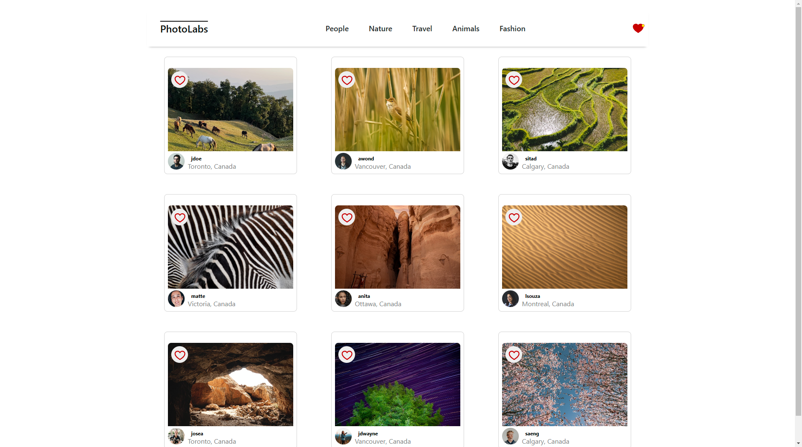
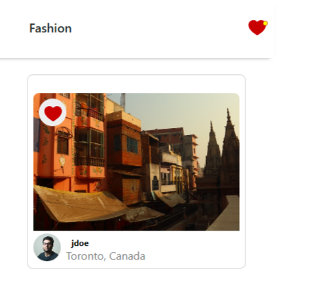

# react-photolabs
The PhotoLabs project for the Web Development React course programming.

# Photolabs

## Setup

Install dependencies with `npm install` in each respective `/frontend` and `/backend`.

## [Frontend] Running Webpack Development Server

```sh
cd frontend
npm start
```

## [Backend] Running Backend Server

Read `backend/readme` for further setup details.

```sh
cd backend
npm start
```

# Description

Photolabs is a single page application build in React and Express. The purpose of the application is to view a list of photos and add them to a 'favourite' list where they can be saved. On selection, a modal appears with a larger view of the image alongside similar images within the modal.

Photos can be filtered by the topics on the top nav bar, when the topic is de-selected the filter is removed and all images will appear again.

# Learning Outcomes

This project demonstrates the fundamental basics of writing an app in React with functional components. The front end communicates with the server (ExpressJS) and renders data from a postgreSQL database. 

State management was initially done using the ```useState``` hook, and then later refactored to use the ```useReducer``` hook to simplify the state and handle the action creators from a seperate file with defined actions.

# Main Page


# View of the modal with similar images


# Filter photos by topics found on the top nav bar



# Notification when photos are liked



# Future features:
- Display liked photos
- Better UX responsiveness when moving the cursor across the page
- Better overflow styling on the modal
- User authentication
- Profile creation 
- Users can submit photos that display with their profile information

# Well...you've made it this far

Thank you for taking your time to review the project. Credit to the database and server side code goes to the wonderful devs at Lighthouse Labs. The front end code was written by myself [@Jaidenpearson](https://github.com/Jaidenpearson) alongside the lessons and directions of Lighthouse Labs. 


